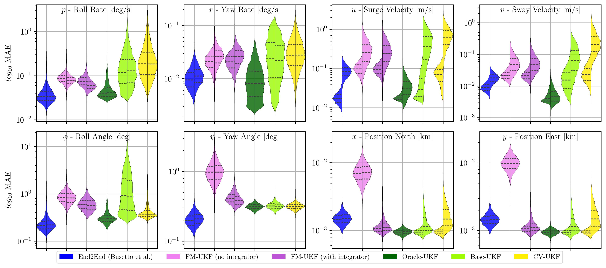

# Foundation Model Unscented Kalman Filter

This is the source code used to generate the results in our paper "Sailing Towards Zero-Shot State Estimation using Foundation Models Combined with a UKF", accepted at the Conference on Decision and Control 2025. ArXiv preprint available [here (INSERT LINK)](arxiv.org).



```bibtex
@inproceedings{holtmann2025fmukf,
  author    = {Tobin Holtmann and David Stenger and Andres Posada-Moreno and Friedrich Solowjow and Sebastian Trimpe},
  title     = {Sailing Towards Zero-Shot State Estimation using Foundation Models Combined with a UKF},
  booktitle = {IEEE Conference on Decision and Control (CDC)},
  year      = {2025},
}
```


## Repository Structure
```
.
├── Experiments/
│   ├── config/                           # All config
│   │   ├── auth.yaml                     # Insert relevant authentication details for Comet_ML, and SLURM if needed
│   │   ├── dataset.yaml
│   │   ├── train_End2End.yaml
│   │   ├── train_FMUKF.yaml
│   │   ├── benchmark.yaml
│   │   └── visualize.yaml
│   ├── train_FMUKF.py
│   ├── train_End2End.py
│   ├── benchmark.py
│   ├── visualize.py
│   ├── benchmark.py                       
│   ├── data/                               # Datasets, and Pretrained Models, and Benchmarking Files 
│   └── temp/                               # Temporary Files generated 
├── src/
│   └── fmukf/
│       ├── benchmarking/                  
│       │   ├── benchmark_worker.py
│       │   ├── build_error_dataframe.py
│       │   ├── configure_estimators.py
│       │   └── merge_h5_files.py
│       ├── estimators/
│       │   ├── estimator_base.py
│       │   ├── End2End.py
│       │   ├── FMUKF.py
│       │   └── UKF.py
│       ├── ML/
│       │   ├── dataloader.py
│       │   ├── integrators.py
│       │   ├── logging_utils.py
│       │   └── models.py                 
│       └── simulation/                
│           ├── container.py
│           ├── controllers.py
│           ├── envsimbase.py
│           └── sensors.py
└── README.md
```


# Installation

**RWTH HPC cluster only**: Initially load modules with every new opened terminal
```bash
module load GCCcore/.13.2.0
module load Python/3.11.5
module load cuDNN/8.6.0.163-CUDA-11.8.0
```

### Create a virtual environment with Python version 3.10.12
This codebase requires a Linux/GNU-based filesystem. It was tested on Linux Mint 22.1 (equivalent to Ubuntu 24.04) and Rocky Linux 9.0.


**Option 1: Mamba** (suggested installer is [Miniforge](https://github.com/conda-forge/miniforge))
```bash
mamba create -n "fmukf" python=3.10.12
mamba activate fmukf
```

**Option 2: Python virtual environment**: (requires Python 3.10.12 as base installation)
```bash
python -m venv .venv
source .venv/bin/activate
```

### Install packages via pip
```bash
pip install -r env_setup/requirements.txt
pip install -e src
```

Note: For reference, the exact versions of Python packages and all of their subdependencies used in the original experiments are listed in `env_setup/exact_requirements.txt`.


### Download Dataset
The dataset for training and benchmarking is hosted on [HuggingFace](https://huggingface.co/datasets/TobinH/FMUKF_dataset). Either manually download and place it as `Experiments/data/Containerships_large.h5` or run the following in terminal:

```bash
hf download TobinH/FMUKF_dataset Containerships_Large.h5 --repo-type dataset --local-dir Experiments/data/
```

### Download Cached Artifacts (Optional)
Cached outputs from each step of the pipeline (e.g., pre-trained models and benchmark results) are hosted on [HuggingFace](https://huggingface.co/datasets/TobinH/FMUKF-Artifacts-Data). This allows your to run each part without fully having to run the pipeline, e.g skip model training and use precomputed models for the benchmark. Download these files to `Experiments/data/`:

```bash
hf download TobinH/FMUKF-Artifacts-Data end2end_model.ckpt --repo-type dataset --local-dir Experiments/data/
hf download TobinH/FMUKF-Artifacts-Data fmukf_model.ckpt --repo-type dataset --local-dir Experiments/data/
hf download TobinH/FMUKF-Artifacts-Data df_err_FINAL.feather --repo-type dataset --local-dir Experiments/data/
```

# Running The Complete Benchmarking Pipeline

`Experiments/` contains the .py files to launch each step in the experimental benchmarking chain, from pre-training the machine learning models to visualization. **For a complete explanation of what each script does, please refer to the files' docstrings.**

All experiments are configured with [Hydra](https://hydra.cc/docs/intro/), i.e., all command line arguments are defined via a `.yaml` file of the same name in `Experiments/config`. Each script will place its output (and any other temporary files) in a new subfolder under `Experiments/temp`. By default, the configuration is set for each step to use the cached outputs (artifacts from the previous step) from the previous output as their inputs (i.e., you can run any of the following in any order). Please refer to the relevant docstrings.

### Train **FMUKF** (Our Method)
```sh
python Experiments/train_FMUKF.py
```

### Train **End2End** 
```sh
python Experiments/train_End2End.py
```

### Benchmarking
This will benchmark the FMUKF, End2End, and classical UKF-based estimator variants over all 100 test ship models.
```sh
python Experiments/benchmark.py
```
### Visualizing Benchmarks
This visualizes the results of the benchmarking as violin plots, saved as PDF and latex table.
```sh
python Experiments/visualize.py
```


# Dataset Generation

Code to generate the dataset. This will be added soon, after final code refactoring and cleaning.


# LICENSE

MIT License


Copyright (c) 2025 Tobin Holtmann
Portions copyright (c) 2004 Thor I. Fossen

Permission is hereby granted, free of charge, to any person obtaining a copy
of this software and associated documentation files (the "Software"), to deal
in the Software without restriction, including without limitation the rights
to use, copy, modify, merge, publish, distribute, sublicense, and/or sell
copies of the Software, and to permit persons to whom the Software is
furnished to do so, subject to the following conditions:

The above copyright notice and this permission notice shall be included in all
copies or substantial portions of the Software.

THE SOFTWARE IS PROVIDED "AS IS", WITHOUT WARRANTY OF ANY KIND, EXPRESS OR
IMPLIED, INCLUDING BUT NOT LIMITED TO THE WARRANTIES OF MERCHANTABILITY,
FITNESS FOR A PARTICULAR PURPOSE AND NONINFRINGEMENT. IN NO EVENT SHALL THE
AUTHORS OR COPYRIGHT HOLDERS BE LIABLE FOR ANY CLAIM, DAMAGES OR OTHER
LIABILITY, WHETHER IN AN ACTION OF CONTRACT, TORT OR OTHERWISE, ARISING FROM,
OUT OF OR IN CONNECTION WITH THE SOFTWARE OR THE USE OR OTHER DEALINGS IN THE
SOFTWARE.